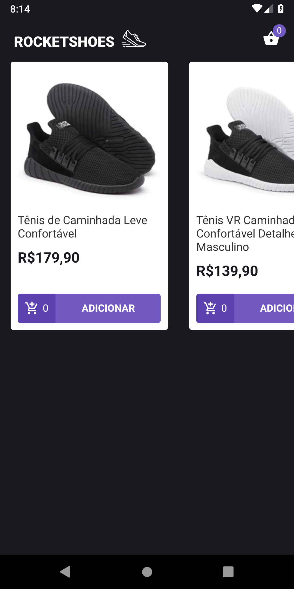
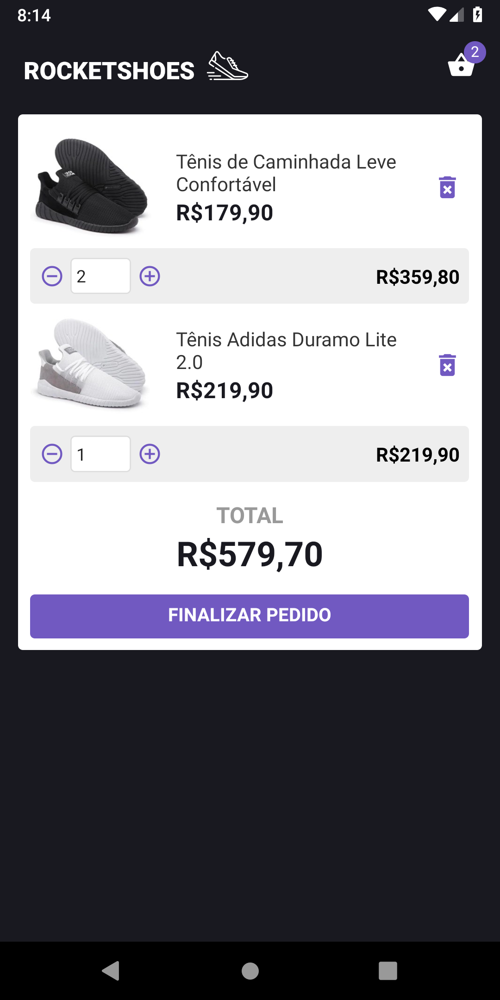

<h1 align="center">
  
</h1>

<h3 align="center">
  Rocketshoes Mobile
</h3>

## :rocket: About

Rocketshoes is an e-commerce built in ReactNative.

Some APIs and libraries used on this project:

**redux**\
**redux-saga**\
**react-redux**\
**axios**\
**react-navigation**\
**immer**\
**polished**\
**prop-types**\
**react**\
**react-natice-vector-icons**\
**reactotron-react-native**\
**reactotron-redux**\
**reactotron-redux-saga**\
**styled-components**

### Instalation ###
-- You need to have Json-server installed;

Clone the repository then:
```
yarn
```
```
json-server server.json -p 3333
```
```
npx react-native run-android
```
```
yarn react-native start
```

### Demo ###



## :memo: Guilherme Ribas
Made by Guilherme Ribas.
